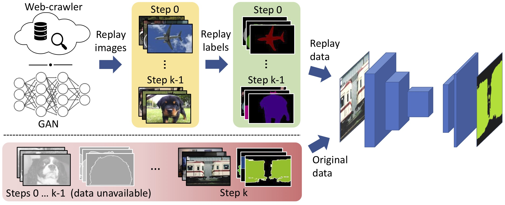
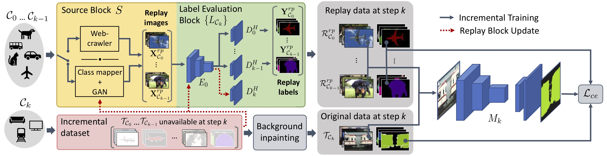

# RECALL
**RECALL: Replay-based Continual Learning in Semantic Segmentation (ICCV 2021)**

Andrea Maracani, Umberto Michieli, Marco Toldo and Pietro Zanuttigh <br /><br />

<div align="center">
 
[](https://arxiv.org/abs/2108.03673)
[](http://iccv2021.thecvf.com/home)
[](https://lttm.dei.unipd.it/paper_data/RECALL/talk.mp4)
[](#Citation)
 
 </div>
 
 
 
> **Abstract:** *Deep networks allow to obtain outstanding results in semantic segmentation, however they need to be trained in a single shot with a large amount of data. Continual learning settings where new classes are learned in incremental steps and previous training data is no longer available are challenging due to the catastrophic forgetting phenomenon. Existing approaches typically fail when several incremental steps are performed or in presence of a distribution shift of the background class. We tackle these issues by recreating no longer available data for the old classes and outlining a content inpainting scheme on the background class. We propose two sources for replay data. The first resorts to a generative adversarial network to sample from the class space of past learning steps. The second relies on web-crawled data to retrieve images containing examples of old classes from online databases. In both scenarios no samples of past steps are stored, thus avoiding privacy concerns. Replay data are then blended with new samples during the incremental steps. Our approach, RECALL, outperforms state-of-the-art methods.*

The full paper can be downloaded from [here](https://arxiv.org/abs/2108.03673)

The slides and poster of the presentation are available: <br/>
[5min slides](https://lttm.dei.unipd.it/paper_data/RECALL/slides.pdf)<br/>
[poster](https://lttm.dei.unipd.it/paper_data/RECALL/poster.pdf)<br/>

<br/>




## Table of Contents
  - [Requirements](#Requirements) 
  - [Getting Started](#getting-started)
  - [Citation](#Citation)

## Requirements
The Pipfile and Pipfile.lock are included in the repository, install it via ```pipenv install```. 
We used Python 3.7 and the dependencies are:
- tensorflow-gpu 1.15 with a compatible version of CUDA.
- tqdm
- gin-config
- pillow
- flickrapi
- tensorflow-hub
- matplotlib

## Getting Started
First of all, download the pretrained model and tfrecords following [this](#download-tfrecord-and-pretrained-model) section. 
Alternatively, it is possible to generate new replay data following [this](#use-other-data) section.

To run an experiment, we need to set all the hyperparameters, including those that specify the experiment setup itself. 
In the file *train_manager.py*, instances of the TrainManager class are initialized with all the information needed for the training procedure.
After a TrainManager object is initialized, it can be used by a Training object (check *training.py*) to execute the experiment itself.
To specify the hyperparameters, we use the gin-config library saving them externally in ```.gin``` files.
In summary, we need to:
- create a ```.gin``` file with all hyperparameters (some examples are placed in the *config/* folder, please refer to them when creating new ones).
- create a *TrainManager* object and specify the desired experiment setup and replay method.
- create a *Training* object to perform the training.

### Incremental Experiments
The predefined experiments are the following:
 - **TEST 0** ADD_ONE_ONE_TIME: 19-1
 - **TEST 1** ADD_FIVE_ONE_TIME: 15-5
 - **TEST 2** ADD_FIVE_TWO_TIMES: 10-5-5
 - **TEST 3** ADD_ONE_FIVE_TIMES: 15-1-1-1-1-1
 - **TEST 4** ADD_TEN_ONE_TIME: 10-10
 - **TEST 5** ADD_TWO_FIVE_TIMES: 10-2-2-2-2-2
 - **TEST 6** ADD_ONE_TEN_TIMES: 10-1-1-1-1-1-1-1-1-1-1
 - **TEST 7** JOINT: 20

Where the first integer specifies the number of classes in the training of the first step, while the following numbers are the number of classes in the incremental steps.

### Replay Methods
The replay methods, as described in the paper, are:

 - **GAN**
 - **FLICKR**

### Example of code
After we write a ```.gin``` config file (or we take one from the *config/* folder), an example of experiment is:

```python
    gin.parse_config_file('config/MY_CONFIG.gin')
    manager = TrainManager(test_type="ADD_ONE_FIVE_TIMES", replay_source="gan")
    training = Training(manager)
    training.train()
```

Where ```MY_CONFIG.gin``` is the specified config file.

All the experiments can be evaluated running ```python main.py``` (running time for all the experiments is less than two days).

### Configuration files
Configuration files are used to setup the experiment and all the hyperparameters needed. 
Their structure is used by the *TrainManager* to optimize training time when some experiments overlap.
In fact, the presence of *parameter indices* allows to determine if some part of the training pipeline can be skipped and some checkpoints, previously computed, can be used.
In any case, some examples of configuration files are in *config/* folder. In the same folder it is possible to find a *readme.txt* that explains more accurately how config files work.

### Download tfrecord and pretrained model
In order to quickly run an experiment, it is suggested to directly download the pretrained models and the tfrecord needed for training and replay. 
They are available [here](https://lttm.dei.unipd.it/paper_data/RECALL/data.zip).
Once the archive has been downloaded, it is enough to extract the files in the *data/* and *checkpoints/* folders as they are found inside the archive. 
For more details about the tree structure of the project, please check the *readme.txt* inside these two folder.

## Replay data
In order to generate replay data from Flickr and GAN sources, it is possible to use some additional scripts that we include in this repository.

### Flickr
The *download_flickr.py* in the *flickr/* folder is an example of script that can be used to download images from [Flickr](https://www.flickr.com).

**Note**: to use the script, a Flickr api_key and secret_key are needed. They are personal and can be obtained for free by registering to the official website.

### GAN
To generate new images following the GAN-based strategy, we provide the script *generate_gan.py* in the *gan/* folder.

**Note**: to use the script, it is required to download a pretrained GAN model and put it in *gan/module/* directory. 
In our experiments we used the BigGAN-deep 512 model that you can find [here](https://tfhub.dev/deepmind/biggan-deep-512/1). 
Once image generation has been completed, it is necessary to assign a classification label (in our case from the class set of the Pascal VOC2012 dataset) to each of the generated images. 
To accomplish this, we used a classifier pretrained on the GAN domain (in our case ImageNet) to classify the images. 
Every class in our dataset is associated to the the class that got the highest confidence in the classification (averaged over all the images containing that class in our dataset). 
In our experiments we followed this approach by employing the ImageNet pretrained EfficientNet-B2 classifier that can be downloaded from TensorFlow hub [here](https://tfhub.dev/google/efficientnet/b2/classification/1). 


Finally, to build the tfrecords files from the newly collected images it is possible to use the dedicated functions to be found in the *data_loader.py* file.

## License

[Apache License 2.0](LICENSE)

<a name="Citation"></a>
## Citation
If you find our work useful, please cite us:
```bibtex
@InProceedings{maracani2021recall,
author = {Maracani, Andrea and Michieli, Umberto and Toldo, Marco and Zanuttigh, Pietro},
title = {RECALL: Replay-based Continual Learning in Semantic Segmentation},
booktitle = {Proceedings of the IEEE/CVF International Conference on Computer Vision (ICCV)},
month = {Oct},
year = {2021}
}
```
